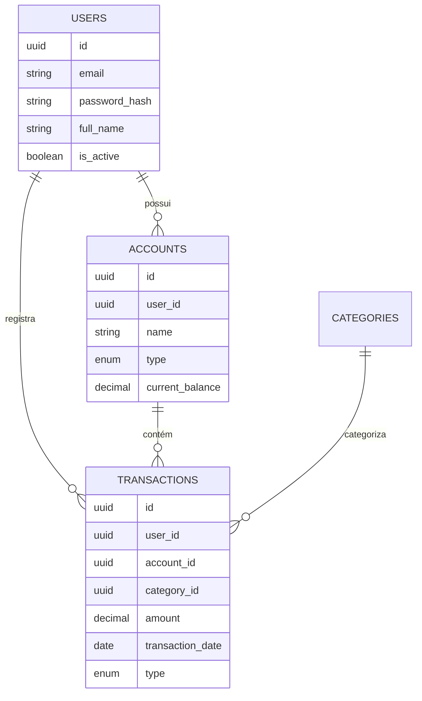

# 📚 Documentação FinanceFlow

<div align="center">

[](https://github.com/renandlsantos/projeto-financias-pessoal)
[](https://github.com/renandlsantos/projeto-financias-pessoal/tree/main/docs)
[](https://github.com/renandlsantos/projeto-financias-pessoal)

**Centro de conhecimento completo do sistema de controle financeiro pessoal**

</div>

---

## 🎯 Visão Geral

Este é o centro de documentação oficial do **FinanceFlow**, um sistema completo de gestão de finanças pessoais desenvolvido com **FastAPI** (backend) e **React TypeScript** (frontend). A documentação está organizada para fornecer contexto completo para desenvolvedores, contribuidores e sistemas de IA.

---

## 📋 Índice da Documentação

### 🚀 [01. Getting Started](./bases/01-getting-started/)
**Início rápido e visão geral do projeto**

- [`project-overview.md`](./bases/01-getting-started/project-overview.md) - Visão geral do FinanceFlow
- [`README.md`](./bases/01-getting-started/README.md) - Instruções de setup inicial

**Contexto para IA**: *Informações essenciais sobre o propósito, escopo e objetivos do projeto*

---

### ⚙️ [02. Configuration](./bases/02-configuration/)
**Configurações de ambiente e infraestrutura**

- [`database.md`](./bases/02-configuration/database.md) - Configuração PostgreSQL e migrações
- [`environment.md`](./bases/02-configuration/environment.md) - Variáveis de ambiente
- [`README.md`](./bases/02-configuration/README.md) - Guia de configuração geral

**Contexto para IA**: *Como configurar e inicializar o ambiente de desenvolvimento*

---

### 🛠️ [03. Development](./bases/03-development/)
**Guias de desenvolvimento e setup**

- [`backend-setup.md`](./bases/03-development/backend-setup.md) - Setup do backend FastAPI
- [`frontend-setup.md`](./bases/03-development/frontend-setup.md) - Setup do frontend React
- [`README.md`](./bases/03-development/README.md) - Workflow de desenvolvimento

**Contexto para IA**: *Procedimentos para setup local, comandos essenciais e workflow de desenvolvimento*

---

### 🏗️ [04. Architecture](./bases/04-architecture/)
**Arquitetura do sistema e padrões**

- [`system-design.md`](./bases/04-architecture/system-design.md) - Design de sistema e microserviços
- [`database-schema.md`](./bases/04-architecture/database-schema.md) - Modelo de dados e relacionamentos
- [`README.md`](./bases/04-architecture/README.md) - Visão arquitetural geral

**Contexto para IA**: *Estrutura do sistema, padrões arquiteturais e decisões de design*

---

### ✨ [05. Features](./bases/05-features/)
**Funcionalidades e casos de uso**

- [`authentication.md`](./bases/05-features/authentication.md) - Sistema de autenticação JWT
- [`transactions.md`](./bases/05-features/transactions.md) - Gestão de transações
- [`reports.md`](./bases/05-features/reports.md) - Sistema de relatórios
- [`README.md`](./bases/05-features/README.md) - Visão geral das features

**Contexto para IA**: *Funcionalidades implementadas, regras de negócio e casos de uso*

---

### 🚀 [06. Deployment](./bases/06-deployment/)
**Deploy e produção**

- [`production.md`](./bases/06-deployment/production.md) - Deploy em produção
- [`README.md`](./bases/06-deployment/README.md) - Estratégias de deploy

**Contexto para IA**: *Processos de deploy, configurações de produção e CI/CD*

---

## 🔧 Stack Tecnológico

### Backend
```yaml
Runtime: Python 3.11+
Framework: FastAPI
ORM: SQLAlchemy 2.0
Database: PostgreSQL 15
Migration: Alembic
Testing: pytest
Security: JWT, bcrypt
Validation: Pydantic
Documentation: Swagger/OpenAPI
```

### Frontend
```yaml
Framework: React 18
Language: TypeScript 5
UI Library: Material-UI v5
State Management: Redux Toolkit
HTTP Client: Axios
Forms: React Hook Form
Build Tool: Vite
Testing: Vitest + Testing Library
```

### DevOps
```yaml
Containerization: Docker + Docker Compose
CI/CD: GitHub Actions (planejado)
Code Quality: ESLint, Prettier
Git Flow: Feature branches
Documentation: Markdown + Mermaid
```

---

## 🏗️ Padrões de Projeto

### Arquitetura Backend
```
📁 backend/app/
├── 🔐 api/v1/          # Endpoints REST API
├── ⚙️ core/           # Configurações centrais  
├── 📊 models/         # SQLAlchemy Models
├── ✅ schemas/        # Pydantic Schemas
└── 🔧 services/       # Lógica de negócio
```

### Arquitetura Frontend
```
📁 frontend/src/
├── 🎨 components/     # Componentes reutilizáveis
├── 📱 pages/          # Páginas da aplicação
├── 🔧 services/       # APIs e integrações
├── 💾 store/          # Estado global (Redux)
├── 🎯 hooks/          # Hooks customizados
└── 📝 types/          # Definições TypeScript
```

---

## 📐 Diretrizes de Desenvolvimento

### 🔒 Segurança
- Validação em todas as entradas
- Autenticação JWT com refresh tokens
- Hashing seguro de senhas (bcrypt)
- Proteção contra SQL injection
- Headers de segurança (CORS, CSP)

### 🎨 UI/UX
- Design mobile-first
- Componentes Material-UI
- Paleta de cores consistente
- Feedback visual para ações
- Tratamento de estados de loading/erro

### 📝 Código
- TypeScript strict mode
- Nomenclatura em inglês para código
- Comentários em português para regras de negócio
- Testes unitários obrigatórios
- Documentação de APIs automática

### 🔄 Git Flow
- Feature branches: `feature/nome-da-feature`
- Commits semânticos: `feat:`, `fix:`, `docs:`
- Pull requests com revisão
- Testes passando antes do merge

---

## 📊 Modelo de Dados

### Entidades Principais


---

## 🔌 Referência da API

### Autenticação
```http
POST /api/v1/auth/login
POST /api/v1/auth/register
POST /api/v1/auth/refresh
POST /api/v1/auth/logout
```

### Usuários
```http
GET    /api/v1/users/me
PUT    /api/v1/users/me
DELETE /api/v1/users/me
```

### Contas
```http
GET    /api/v1/accounts
POST   /api/v1/accounts
GET    /api/v1/accounts/{id}
PUT    /api/v1/accounts/{id}
DELETE /api/v1/accounts/{id}
```

### Transações
```http
GET    /api/v1/transactions
POST   /api/v1/transactions
GET    /api/v1/transactions/{id}
PUT    /api/v1/transactions/{id}
DELETE /api/v1/transactions/{id}
```

**📖 Documentação Completa**: Disponível em `/docs` quando o backend estiver rodando

---

## 🧪 Testes

### Backend
```bash
# Executar todos os testes
pytest

# Testes com cobertura
pytest --cov=app --cov-report=html

# Testes específicos
pytest tests/test_auth.py
```

### Frontend
```bash
# Executar todos os testes
npm test

# Testes com coverage
npm run test:coverage

# Testes em modo watch
npm run test:watch
```

---

## 🤝 Guia de Contribuição

### 1. Setup do Ambiente
```bash
# Clone o repositório
git clone https://github.com/renandlsantos/projeto-financias-pessoal.git
cd projeto-financias-pessoal

# Execute com Docker
docker-compose up --build
```

### 2. Workflow de Desenvolvimento
```bash
# Crie uma nova feature branch
git checkout -b feature/nova-funcionalidade

# Faça suas alterações
# ...

# Execute os testes
npm test && pytest

# Commit suas alterações
git add .
git commit -m "feat: adiciona nova funcionalidade"

# Push e abra um Pull Request
git push origin feature/nova-funcionalidade
```

### 3. Padrões de Commit
```
feat: nova funcionalidade
fix: correção de bug
docs: documentação
style: formatação
refactor: refatoração
test: testes
chore: tarefas de build/CI
```

---

## 🔍 Componentes Principais

### Frontend
```typescript
// Componentes de Layout
MainLayout          // Layout principal com sidebar
Header              // Cabeçalho com navegação
Sidebar             // Menu lateral

// Componentes de UI
Button              // Botão customizado
Card                // Card com Material-UI
Loading             // Indicador de carregamento
ErrorBoundary       // Tratamento de erros

// Hooks Customizados
useAuth()           // Gerenciamento de autenticação
useApi()            // Chamadas de API
useLocalStorage()   // Persistência local
```

### Backend
```python
# Services (Lógica de Negócio)
AuthService         # Autenticação e autorização
UserService         # Gestão de usuários
AccountService      # Gestão de contas
TransactionService  # Gestão de transações

# Models (SQLAlchemy)
User               # Modelo de usuário
Account            # Modelo de conta
Transaction        # Modelo de transação
Category           # Modelo de categoria

# Schemas (Pydantic)
UserSchema         # Validação de usuário
AccountSchema      # Validação de conta
TransactionSchema  # Validação de transação
```

---

## ⚡ Comandos Essenciais

### Desenvolvimento Rápido
```bash
# Iniciar ambiente completo
docker-compose up --build

# Backend apenas
cd backend && uvicorn app.main:app --reload

# Frontend apenas
cd frontend && npm run dev

# Executar migrações
cd backend && alembic upgrade head

# Gerar nova migração
cd backend && alembic revision --autogenerate -m "descrição"
```

---

## 📈 Métricas e Monitoramento

### Qualidade de Código
- Cobertura de testes: > 80%
- ESLint: 0 erros
- TypeScript: strict mode
- Vulnerabilidades: 0 críticas

### Performance
- Tempo de resposta API: < 200ms
- Carregamento frontend: < 3s
- Lighthouse Score: > 90

---

## 🔗 Links Úteis

- **📋 PRD Completo**: [../prd.md](../prd.md)
- **🏠 README Principal**: [../README.md](../README.md)
- **⚙️ Configuração Copilot**: [../.github/copilot-instructions.md](../.github/copilot-instructions.md)
- **🐳 Docker Compose**: [../docker-compose.yml](../docker-compose.yml)
- **📦 Backend Package**: [../backend/requirements.txt](../backend/requirements.txt)
- **📦 Frontend Package**: [../frontend/package.json](../frontend/package.json)

---

## 🆘 Suporte e Contato

### Para Desenvolvedores
- Abra uma [Issue](https://github.com/renandlsantos/projeto-financias-pessoal/issues) para bugs
- Crie um [Pull Request](https://github.com/renandlsantos/projeto-financias-pessoal/pulls) para contribuições
- Consulte a documentação antes de fazer alterações

### Para IA/Copilot
Esta documentação fornece o contexto completo necessário para:
- Entender a arquitetura do sistema
- Conhecer padrões e convenções
- Acessar referências de API e modelos
- Compreender workflow de desenvolvimento
- Localizar arquivos e estruturas

---

<div align="center">

**🔄 Documentação atualizada**: Agosto 2025  
**📊 Versão do projeto**: 3.0  
**🚀 Status**: Em desenvolvimento ativo

**Construído com ❤️ usando FastAPI + React + TypeScript**

</div>
