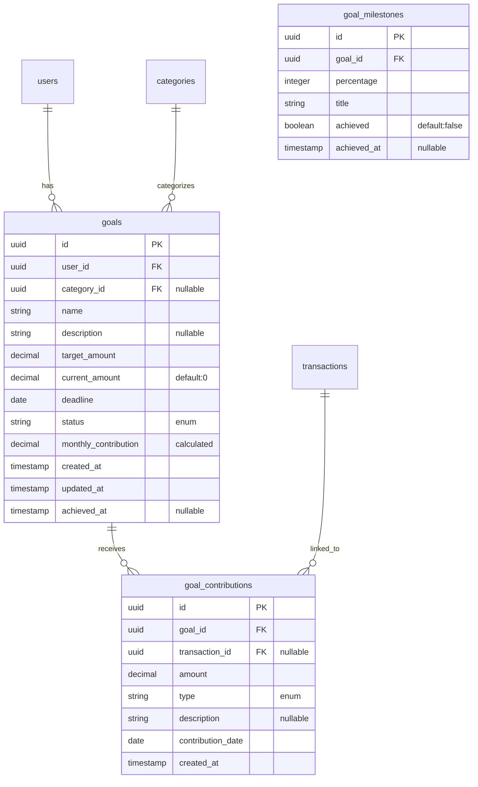

# 🗄️ Database Schema - Metas Financeiras (Goals)

## 📊 Diagrama ER



## 📋 Tabela: goals

### Estrutura:
```sql
CREATE TABLE goals (
    id UUID PRIMARY KEY DEFAULT gen_random_uuid(),
    user_id UUID NOT NULL REFERENCES users(id) ON DELETE CASCADE,
    category_id UUID REFERENCES categories(id) ON DELETE SET NULL,
    name VARCHAR(100) NOT NULL,
    description TEXT,
    target_amount DECIMAL(12, 2) NOT NULL CHECK (target_amount > 0),
    current_amount DECIMAL(12, 2) NOT NULL DEFAULT 0 CHECK (current_amount >= 0),
    deadline DATE NOT NULL CHECK (deadline > CURRENT_DATE),
    status VARCHAR(20) NOT NULL DEFAULT 'DRAFT',
    monthly_contribution DECIMAL(12, 2) GENERATED ALWAYS AS (
        CASE 
            WHEN deadline > CURRENT_DATE AND current_amount < target_amount
            THEN (target_amount - current_amount) / GREATEST(1, EXTRACT(MONTH FROM age(deadline, CURRENT_DATE)))
            ELSE 0
        END
    ) STORED,
    color VARCHAR(7),
    icon VARCHAR(50),
    priority INTEGER DEFAULT 1 CHECK (priority BETWEEN 1 AND 5),
    is_recurring BOOLEAN DEFAULT FALSE,
    recurrence_day INTEGER CHECK (recurrence_day BETWEEN 1 AND 31),
    created_at TIMESTAMP WITH TIME ZONE DEFAULT CURRENT_TIMESTAMP,
    updated_at TIMESTAMP WITH TIME ZONE DEFAULT CURRENT_TIMESTAMP,
    achieved_at TIMESTAMP WITH TIME ZONE,
    paused_at TIMESTAMP WITH TIME ZONE,
    
    CONSTRAINT valid_status CHECK (status IN (
        'DRAFT', 'IN_PROGRESS', 'PAUSED', 
        'COMPLETED', 'CANCELLED', 'OVERDUE'
    )),
    CONSTRAINT valid_amounts CHECK (current_amount <= target_amount OR status = 'COMPLETED'),
    CONSTRAINT valid_achievement CHECK (
        (status = 'COMPLETED' AND achieved_at IS NOT NULL) OR
        (status != 'COMPLETED' AND achieved_at IS NULL)
    ),
    CONSTRAINT unique_active_goal_name UNIQUE (user_id, name, status) 
        WHERE status IN ('DRAFT', 'IN_PROGRESS', 'PAUSED')
);

-- Índices para performance
CREATE INDEX idx_goals_user_status ON goals(user_id, status);
CREATE INDEX idx_goals_deadline ON goals(deadline) WHERE status = 'IN_PROGRESS';
CREATE INDEX idx_goals_category ON goals(category_id) WHERE category_id IS NOT NULL;
CREATE INDEX idx_goals_created_at ON goals(created_at DESC);
```

## 📋 Tabela: goal_contributions

### Estrutura:
```sql
CREATE TABLE goal_contributions (
    id UUID PRIMARY KEY DEFAULT gen_random_uuid(),
    goal_id UUID NOT NULL REFERENCES goals(id) ON DELETE CASCADE,
    transaction_id UUID REFERENCES transactions(id) ON DELETE SET NULL,
    amount DECIMAL(12, 2) NOT NULL CHECK (amount > 0),
    type VARCHAR(20) NOT NULL DEFAULT 'MANUAL',
    description TEXT,
    contribution_date DATE NOT NULL DEFAULT CURRENT_DATE,
    is_recurring BOOLEAN DEFAULT FALSE,
    created_by UUID NOT NULL REFERENCES users(id),
    created_at TIMESTAMP WITH TIME ZONE DEFAULT CURRENT_TIMESTAMP,
    
    CONSTRAINT valid_contribution_type CHECK (type IN (
        'MANUAL', 'AUTOMATIC', 'TRANSACTION', 'RECURRING'
    )),
    CONSTRAINT unique_transaction_contribution UNIQUE (transaction_id) 
        WHERE transaction_id IS NOT NULL
);

-- Índices
CREATE INDEX idx_contributions_goal ON goal_contributions(goal_id);
CREATE INDEX idx_contributions_date ON goal_contributions(contribution_date DESC);
CREATE INDEX idx_contributions_transaction ON goal_contributions(transaction_id) 
    WHERE transaction_id IS NOT NULL;
```

## 📋 Tabela: goal_milestones

### Estrutura:
```sql
CREATE TABLE goal_milestones (
    id UUID PRIMARY KEY DEFAULT gen_random_uuid(),
    goal_id UUID NOT NULL REFERENCES goals(id) ON DELETE CASCADE,
    percentage INTEGER NOT NULL CHECK (percentage BETWEEN 1 AND 100),
    title VARCHAR(100) NOT NULL,
    description TEXT,
    reward_type VARCHAR(20),
    achieved BOOLEAN DEFAULT FALSE,
    achieved_at TIMESTAMP WITH TIME ZONE,
    created_at TIMESTAMP WITH TIME ZONE DEFAULT CURRENT_TIMESTAMP,
    
    CONSTRAINT unique_goal_percentage UNIQUE (goal_id, percentage),
    CONSTRAINT valid_achievement CHECK (
        (achieved = true AND achieved_at IS NOT NULL) OR
        (achieved = false AND achieved_at IS NULL)
    )
);

-- Índices
CREATE INDEX idx_milestones_goal ON goal_milestones(goal_id);
CREATE INDEX idx_milestones_achieved ON goal_milestones(achieved);
```

## 🔧 Triggers e Functions

### 1. Atualizar current_amount automaticamente:
```sql
CREATE OR REPLACE FUNCTION update_goal_current_amount()
RETURNS TRIGGER AS $$
BEGIN
    IF TG_OP = 'INSERT' OR TG_OP = 'UPDATE' THEN
        UPDATE goals 
        SET current_amount = (
            SELECT COALESCE(SUM(amount), 0)
            FROM goal_contributions
            WHERE goal_id = NEW.goal_id
        ),
        updated_at = CURRENT_TIMESTAMP
        WHERE id = NEW.goal_id;
    ELSIF TG_OP = 'DELETE' THEN
        UPDATE goals 
        SET current_amount = (
            SELECT COALESCE(SUM(amount), 0)
            FROM goal_contributions
            WHERE goal_id = OLD.goal_id
        ),
        updated_at = CURRENT_TIMESTAMP
        WHERE id = OLD.goal_id;
    END IF;
    RETURN NULL;
END;
$$ LANGUAGE plpgsql;

CREATE TRIGGER trigger_update_goal_amount
AFTER INSERT OR UPDATE OR DELETE ON goal_contributions
FOR EACH ROW EXECUTE FUNCTION update_goal_current_amount();
```

### 2. Atualizar status da meta automaticamente:
```sql
CREATE OR REPLACE FUNCTION update_goal_status()
RETURNS TRIGGER AS $$
BEGIN
    -- Marcar como COMPLETED quando atingir o valor alvo
    IF NEW.current_amount >= NEW.target_amount AND NEW.status = 'IN_PROGRESS' THEN
        NEW.status := 'COMPLETED';
        NEW.achieved_at := CURRENT_TIMESTAMP;
        
        -- Atualizar milestones
        UPDATE goal_milestones
        SET achieved = TRUE,
            achieved_at = CURRENT_TIMESTAMP
        WHERE goal_id = NEW.id AND achieved = FALSE;
    END IF;
    
    -- Marcar como OVERDUE se passar do prazo
    IF NEW.deadline < CURRENT_DATE AND NEW.status = 'IN_PROGRESS' THEN
        NEW.status := 'OVERDUE';
    END IF;
    
    RETURN NEW;
END;
$$ LANGUAGE plpgsql;

CREATE TRIGGER trigger_update_goal_status
BEFORE UPDATE ON goals
FOR EACH ROW EXECUTE FUNCTION update_goal_status();
```

### 3. Verificar milestones atingidos:
```sql
CREATE OR REPLACE FUNCTION check_goal_milestones()
RETURNS TRIGGER AS $$
DECLARE
    progress_percentage INTEGER;
BEGIN
    -- Calcular percentual de progresso
    SELECT (current_amount / target_amount * 100)::INTEGER
    INTO progress_percentage
    FROM goals
    WHERE id = NEW.goal_id;
    
    -- Atualizar milestones atingidos
    UPDATE goal_milestones
    SET achieved = TRUE,
        achieved_at = CURRENT_TIMESTAMP
    WHERE goal_id = NEW.goal_id
        AND percentage <= progress_percentage
        AND achieved = FALSE;
    
    RETURN NEW;
END;
$$ LANGUAGE plpgsql;

CREATE TRIGGER trigger_check_milestones
AFTER INSERT ON goal_contributions
FOR EACH ROW EXECUTE FUNCTION check_goal_milestones();
```

## 📊 Views Úteis

### 1. View de Resumo de Metas:
```sql
CREATE VIEW v_goals_summary AS
SELECT 
    g.*,
    u.name as user_name,
    c.name as category_name,
    c.color as category_color,
    c.icon as category_icon,
    CASE 
        WHEN g.target_amount > 0 
        THEN ROUND((g.current_amount / g.target_amount * 100), 2)
        ELSE 0
    END as progress_percentage,
    CASE
        WHEN g.deadline >= CURRENT_DATE 
        THEN g.deadline - CURRENT_DATE
        ELSE 0
    END as days_remaining,
    CASE
        WHEN g.status = 'IN_PROGRESS' AND g.current_amount >= g.monthly_contribution * 
            EXTRACT(MONTH FROM age(CURRENT_DATE, g.created_at::DATE))
        THEN 'ON_TRACK'
        WHEN g.status = 'IN_PROGRESS' AND g.current_amount < g.monthly_contribution * 
            EXTRACT(MONTH FROM age(CURRENT_DATE, g.created_at::DATE))
        THEN 'BEHIND'
        WHEN g.status = 'IN_PROGRESS'
        THEN 'AHEAD'
        ELSE g.status
    END as pace_status,
    COUNT(DISTINCT gc.id) as total_contributions,
    MAX(gc.contribution_date) as last_contribution_date
FROM goals g
LEFT JOIN users u ON g.user_id = u.id
LEFT JOIN categories c ON g.category_id = c.id
LEFT JOIN goal_contributions gc ON g.id = gc.goal_id
GROUP BY g.id, u.name, c.name, c.color, c.icon;
```

### 2. View de Histórico de Contribuições:
```sql
CREATE VIEW v_contribution_history AS
SELECT 
    gc.*,
    g.name as goal_name,
    g.target_amount,
    g.current_amount as goal_current_amount,
    t.description as transaction_description,
    t.amount as transaction_amount,
    u.name as contributor_name
FROM goal_contributions gc
JOIN goals g ON gc.goal_id = g.id
LEFT JOIN transactions t ON gc.transaction_id = t.id
JOIN users u ON gc.created_by = u.id
ORDER BY gc.contribution_date DESC, gc.created_at DESC;
```

## 🔄 Migrations

### Migration Up:
```sql
-- Create goals table
CREATE TABLE goals (...);

-- Create goal_contributions table
CREATE TABLE goal_contributions (...);

-- Create goal_milestones table
CREATE TABLE goal_milestones (...);

-- Create triggers
CREATE TRIGGER trigger_update_goal_amount ...;
CREATE TRIGGER trigger_update_goal_status ...;
CREATE TRIGGER trigger_check_milestones ...;

-- Create views
CREATE VIEW v_goals_summary ...;
CREATE VIEW v_contribution_history ...;

-- Insert default milestones template
INSERT INTO goal_milestones (goal_id, percentage, title) VALUES
    (NULL, 25, 'Um Quarto do Caminho!'),
    (NULL, 50, 'Metade Alcançada!'),
    (NULL, 75, 'Quase Lá!'),
    (NULL, 100, 'Meta Conquistada!');
```

### Migration Down:
```sql
DROP VIEW IF EXISTS v_contribution_history;
DROP VIEW IF EXISTS v_goals_summary;
DROP TRIGGER IF EXISTS trigger_check_milestones ON goal_contributions;
DROP TRIGGER IF EXISTS trigger_update_goal_status ON goals;
DROP TRIGGER IF EXISTS trigger_update_goal_amount ON goal_contributions;
DROP TABLE IF EXISTS goal_milestones;
DROP TABLE IF EXISTS goal_contributions;
DROP TABLE IF EXISTS goals;
```

## 📈 Queries de Exemplo

### 1. Buscar metas ativas do usuário:
```sql
SELECT * FROM v_goals_summary
WHERE user_id = $1 
  AND status IN ('IN_PROGRESS', 'PAUSED')
ORDER BY deadline ASC;
```

### 2. Calcular total economizado:
```sql
SELECT 
    COUNT(*) as total_goals,
    SUM(current_amount) as total_saved,
    SUM(target_amount) as total_target,
    AVG(progress_percentage) as avg_progress
FROM v_goals_summary
WHERE user_id = $1;
```

### 3. Metas próximas do vencimento:
```sql
SELECT * FROM v_goals_summary
WHERE user_id = $1
  AND status = 'IN_PROGRESS'
  AND days_remaining <= 30
ORDER BY days_remaining ASC;
```

---

*Schema otimizado para performance e integridade referencial*