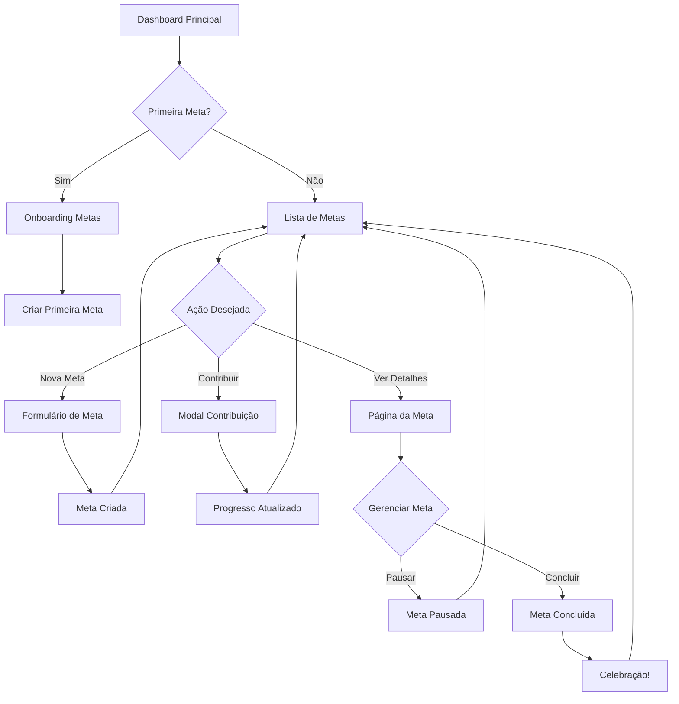

# 🎨 UX Design - Fluxos de Metas Financeiras

## 🎯 Visão Geral do Design
**Feature:** Metas Financeiras  
**Princípios:** Clareza, Motivação, Progressão Visual  
**Estilo:** Material Design 3.0 com elementos gamificados  

## 🔄 Fluxo Principal: Jornada do Usuário



## 📱 Wireframes Detalhados

### 1. Dashboard de Metas
```
┌─────────────────────────────────────┐
│ ← Voltar    💰 Minhas Metas    ⚙️  │
├─────────────────────────────────────┤
│                                     │
│  Resumo Geral                       │
│  ┌─────────────────────────────┐   │
│  │ 📊 4 Metas Ativas           │   │
│  │ 💵 R$ 25.750 economizados   │   │
│  │ 🎯 65% do total planejado   │   │
│  └─────────────────────────────┘   │
│                                     │
│  [Todas] [Ativas] [Concluídas]     │
│                                     │
│  ┌─────────────────────────────┐   │
│  │ 🏖️ Viagem Europa            │   │
│  │ ████████████░░░░ 75%       │   │
│  │ R$ 11.250 / R$ 15.000      │   │
│  │ ⏰ 4 meses restantes        │   │
│  │ 📈 No prazo                 │   │
│  └─────────────────────────────┘   │
│                                     │
│  ┌─────────────────────────────┐   │
│  │ 🚗 Carro Novo               │   │
│  │ ████████░░░░░░░░ 40%       │   │
│  │ R$ 20.000 / R$ 50.000      │   │
│  │ ⏰ 18 meses restantes       │   │
│  │ ⚠️ Atrasado (-R$ 500)      │   │
│  └─────────────────────────────┘   │
│                                     │
│         (+) Nova Meta               │
└─────────────────────────────────────┘
```

### 2. Formulário de Nova Meta
```
┌─────────────────────────────────────┐
│ ← Cancelar   Nova Meta    Salvar ✓ │
├─────────────────────────────────────┤
│                                     │
│  🎯 Defina sua Meta                │
│                                     │
│  Nome da Meta *                    │
│  ┌─────────────────────────────┐   │
│  │ Ex: Viagem dos Sonhos       │   │
│  └─────────────────────────────┘   │
│                                     │
│  Valor Alvo *                      │
│  ┌─────────────────────────────┐   │
│  │ R$ 0,00                     │   │
│  └─────────────────────────────┘   │
│                                     │
│  Data Limite *                     │
│  ┌─────────────────────────────┐   │
│  │ 📅 Selecionar data          │   │
│  └─────────────────────────────┘   │
│                                     │
│  Categoria (opcional)              │
│  ┌─────────────────────────────┐   │
│  │ ▼ Escolher categoria        │   │
│  └─────────────────────────────┘   │
│                                     │
│  Descrição                         │
│  ┌─────────────────────────────┐   │
│  │ Por que essa meta é         │   │
│  │ importante para você?       │   │
│  │                             │   │
│  └─────────────────────────────┘   │
│                                     │
│  💡 Sugestão de Economia           │
│  ┌─────────────────────────────┐   │
│  │ Para alcançar sua meta,     │   │
│  │ economize R$ 1.250/mês     │   │
│  └─────────────────────────────┘   │
│                                     │
│  □ Criar contribuição mensal       │
│     automática                     │
│                                     │
│  [Cancelar]  [Criar Meta]          │
└─────────────────────────────────────┘
```

### 3. Página de Detalhes da Meta
```
┌─────────────────────────────────────┐
│ ← Voltar              ⋮ Opções     │
├─────────────────────────────────────┤
│                                     │
│  🏖️ Viagem para Europa             │
│                                     │
│  ┌─────────────────────────────┐   │
│  │      R$ 11.250,00           │   │
│  │   ████████████░░░░          │   │
│  │        75%                  │   │
│  │   de R$ 15.000,00          │   │
│  └─────────────────────────────┘   │
│                                     │
│  📊 Estatísticas                   │
│  ├─ Criada em: 01/01/2025         │
│  ├─ Prazo: 30/06/2026             │
│  ├─ Dias restantes: 120           │
│  ├─ Média mensal: R$ 937,50       │
│  └─ Status: ✅ No prazo           │
│                                     │
│  📈 Progresso Mensal               │
│  ┌─────────────────────────────┐   │
│  │   Jan  Fev  Mar  Abr  Mai   │   │
│  │   ███  ███  ███  ███  ██░   │   │
│  │  1250 1250 1250 1250  625   │   │
│  └─────────────────────────────┘   │
│                                     │
│  💰 Últimas Contribuições          │
│  ┌─────────────────────────────┐   │
│  │ 15/05 | + R$ 625,00        │   │
│  │ 01/05 | + R$ 1.250,00      │   │
│  │ 01/04 | + R$ 1.250,00      │   │
│  │ Ver todas →                │   │
│  └─────────────────────────────┘   │
│                                     │
│  [+ Adicionar Contribuição]        │
│                                     │
└─────────────────────────────────────┘
```

### 4. Modal de Contribuição
```
┌─────────────────────────────────────┐
│         Adicionar Contribuição      │
├─────────────────────────────────────┤
│                                     │
│  Meta: Viagem para Europa          │
│  Faltam: R$ 3.750,00              │
│                                     │
│  Valor da Contribuição *           │
│  ┌─────────────────────────────┐   │
│  │ R$ 0,00                     │   │
│  └─────────────────────────────┘   │
│                                     │
│  Valores Sugeridos:                │
│  [R$ 500] [R$ 1.000] [R$ 1.250]   │
│                                     │
│  Data                             │
│  ┌─────────────────────────────┐   │
│  │ 📅 Hoje                     │   │
│  └─────────────────────────────┘   │
│                                     │
│  Descrição (opcional)              │
│  ┌─────────────────────────────┐   │
│  │ Ex: Bônus do trabalho      │   │
│  └─────────────────────────────┘   │
│                                     │
│  □ Repetir mensalmente             │
│                                     │
│  [Cancelar]  [Adicionar]           │
└─────────────────────────────────────┘
```

### 5. Tela de Celebração (Meta Concluída)
```
┌─────────────────────────────────────┐
│                                     │
│                                     │
│            🎉                      │
│                                     │
│     Parabéns! Meta Alcançada!     │
│                                     │
│         Viagem para Europa         │
│         R$ 15.000,00              │
│                                     │
│     Economizado em 10 meses        │
│                                     │
│    ⭐⭐⭐⭐⭐                    │
│                                     │
│  Compartilhar conquista:           │
│  [📱] [📧] [🔗]                   │
│                                     │
│  [Ver Minhas Metas] [Nova Meta]    │
│                                     │
└─────────────────────────────────────┘
```

## 🎨 Diretrizes Visuais

### Paleta de Cores para Status:
- **Em Progresso:** Azul (#2196F3)
- **No Prazo:** Verde (#4CAF50)
- **Atrasado:** Amarelo (#FFC107)
- **Crítico:** Vermelho (#F44336)
- **Concluída:** Dourado (#FFD700)
- **Pausada:** Cinza (#9E9E9E)

### Ícones por Categoria:
- 🏖️ Viagens
- 🚗 Veículos
- 🏠 Casa Própria
- 📚 Educação
- 💍 Casamento
- 👶 Filhos
- 🏥 Emergência
- 💼 Negócio Próprio
- 🎮 Lazer
- 📱 Tecnologia

### Animações e Micro-interações:
1. **Barra de Progresso:** Animação suave ao atualizar
2. **Contribuição:** Confetti ao atingir marcos (25%, 50%, 75%, 100%)
3. **Cards:** Hover com elevação e sombra
4. **Botões:** Ripple effect no toque
5. **Transições:** Slide entre telas

## 📊 Estados e Feedback

### Estados de Loading:
```
┌─────────────────────────────────────┐
│                                     │
│         ⟳ Carregando...           │
│     Suas metas estão sendo         │
│        sincronizadas               │
│                                     │
└─────────────────────────────────────┘
```

### Estados Vazios:
```
┌─────────────────────────────────────┐
│                                     │
│            🎯                      │
│                                     │
│   Você ainda não tem metas         │
│                                     │
│   Que tal criar sua primeira       │
│   meta financeira hoje?            │
│                                     │
│     [Criar Primeira Meta]          │
│                                     │
└─────────────────────────────────────┘
```

### Mensagens de Erro:
```
┌─────────────────────────────────────┐
│  ⚠️ Erro ao salvar meta            │
│  O valor deve ser maior que zero   │
│  [Tentar Novamente]                │
└─────────────────────────────────────┘
```

## 🔔 Notificações e Alertas

### Tipos de Notificações:
1. **Lembrete Mensal:**
   - "Hora de contribuir para sua meta 'Viagem Europa'"
   
2. **Marco Atingido:**
   - "Parabéns! Você atingiu 50% da sua meta!"
   
3. **Prazo Aproximando:**
   - "Faltam 30 dias para o prazo da meta 'Carro Novo'"
   
4. **Meta Atrasada:**
   - "Sua meta está R$ 500 abaixo do esperado"

## 📱 Responsividade

### Mobile (< 768px):
- Cards em coluna única
- FAB para nova meta
- Menu hambúrguer
- Swipe para ações rápidas

### Tablet (768px - 1024px):
- Grid 2 colunas para cards
- Sidebar collapsível
- Touch gestures

### Desktop (> 1024px):
- Grid 3 colunas para cards
- Sidebar fixa
- Tooltips on hover
- Atalhos de teclado

## ⚡ Performance e Otimização

### Estratégias:
1. **Lazy Loading:** Carregar histórico sob demanda
2. **Cache Local:** Armazenar metas no localStorage
3. **Debounce:** Em campos de valor (300ms)
4. **Virtual Scrolling:** Para listas longas
5. **Optimistic Updates:** Atualizar UI antes da confirmação

## 🎮 Elementos de Gamificação

### Conquistas:
- 🥉 **Primeira Meta:** Criar primeira meta
- 🥈 **Poupador:** Economizar R$ 10.000 total
- 🥇 **Mestre das Metas:** Concluir 10 metas
- 💎 **Disciplinado:** Contribuir por 12 meses seguidos

### Níveis de Usuário:
1. **Iniciante:** 0-2 metas concluídas
2. **Poupador:** 3-5 metas concluídas
3. **Investidor:** 6-10 metas concluídas
4. **Expert:** 11+ metas concluídas

---

*Design criado seguindo princípios de UX modernos e acessibilidade WCAG 2.1*