# 📊 PRD - Sistema de Controle Financeiro Pessoal
## 💰 FinanceFlow v3.0

---

<div align="center">

[](https://github.com/renandlsantos/projeto-financias-pessoal)
[](https://github.com/renandlsantos/projeto-financias-pessoal)
[](https://github.com/renandlsantos/projeto-financias-pessoal)

**Sistema completo de gestão de finanças pessoais com arquitetura moderna e interface intuitiva**

</div>

---

## 📋 Índice

1. [🎯 Visão Executiva](#1-visão-executiva)
2. [📊 Análise de Mercado](#2-análise-de-mercado)
3. [👥 Personas Detalhadas](#3-personas-detalhadas)
4. [⚙️ Arquitetura & Implementação](#4-arquitetura--implementação)
5. [🔧 Stack Tecnológico Atual](#5-stack-tecnológico-atual)
6. [🚀 Requisitos Funcionais](#6-requisitos-funcionais)
7. [📈 Fluxogramas e Diagramas](#7-fluxogramas-e-diagramas)
8. [🛠️ Roadmap de Desenvolvimento](#8-roadmap-de-desenvolvimento)
9. [💰 Modelo de Negócio](#9-modelo-de-negócio)
10. [⚠️ Riscos e Mitigações](#10-riscos-e-mitigações)

---


### 1. VISÃO EXECUTIVA

#### 1.1 Problema
Pessoas físicas enfrentam dificuldades significativas no controle de suas finanças pessoais:
- 78% dos brasileiros não conseguem poupar regularmente
- 65% não sabem exatamente onde gastam seu dinheiro
- 82% não possuem controle efetivo de orçamento
- 45% se endividam por falta de planejamento financeiro

#### 1.2 Solução
FinanceFlow é uma plataforma web completa de gestão financeira pessoal que oferece:
- Visibilidade total das finanças em tempo real
- Categorização automática inteligente de gastos
- Sistema de metas e orçamentos com alertas proativos
- Relatórios e insights acionáveis
- Interface intuitiva e responsiva

#### 1.3 Objetivos de Negócio
- Atingir 10.000 usuários ativos
- Atingir 50.000 usuários e implementar modelo freemium
- Atingir 200.000 usuários e break-even

---


### 2. ANÁLISE DE MERCADO

#### 2.1 Tamanho do Mercado
- **TAM**: R$ 2.5 bilhões (mercado de gestão financeira pessoal no Brasil)
- **SAM**: R$ 500 milhões (aplicações web/mobile)
- **SOM**: R$ 50 milhões (5 anos)

#### 2.2 Competidores
| Competidor | Pontos Fortes | Pontos Fracos | Diferencial FinanceFlow |
|------------|---------------|---------------|-------------------------|
| Mobills | Grande base de usuários | Interface complexa | UX simplificada |
| Organizze | Funcionalidades robustas | Caro | Freemium generoso |
| GuiaBolso | Integração bancária | Privacidade | Controle manual seguro |

#### 2.3 Posicionamento
"A ferramenta mais intuitiva e completa para quem quer tomar controle real de suas finanças, sem complicação."

---

### 3. PERSONAS DETALHADAS

#### 3.1 Persona Primária - Marina Costa
**Demografia**
- Idade: 32 anos
- Profissão: Analista de Marketing
- Renda: R$ 6.500/mês
- Local: São Paulo, SP
- Estado civil: Solteira

**Comportamento Financeiro**
- Gasta 30% em moradia, 20% em alimentação, 15% em transporte
- Usa 3 cartões de crédito diferentes
- Tem dificuldade em economizar para objetivos
- Faz compras por impulso online

**Dores**
- "Não sei onde meu dinheiro vai parar"
- "Sempre estouro o cartão de crédito"
- "Quero viajar mas nunca sobra dinheiro"
- "Planilhas são muito trabalhosas"

**Necessidades**
- Visualização clara e imediata dos gastos
- Alertas antes de estourar limites
- Planejamento de metas tangíveis
- Simplicidade de uso

#### 3.2 Persona Secundária - Ricardo Almeida
**Demografia**
- Idade: 45 anos
- Profissão: Pequeno empresário (MEI)
- Renda: R$ 8.000-15.000/mês (variável)
- Local: Belo Horizonte, MG
- Estado civil: Casado, 2 filhos

**Comportamento Financeiro**
- Mistura finanças pessoais e empresariais
- Renda variável dificulta planejamento
- Precisa separar gastos para impostos
- Quer construir patrimônio para família

**Necessidades**
- Múltiplas contas/projetos
- Relatórios para contabilidade
- Projeção de fluxo de caixa
- Planejamento familiar

---

### 4. REQUISITOS FUNCIONAIS DETALHADOS

#### 4.1 Módulo de Autenticação e Usuários

##### RF-AUTH-001: Cadastro de Usuário
- **Descrição**: Permitir registro com email e senha
- **Campos obrigatórios**: Nome, email, senha (min 8 caracteres)
- **Validações**: Email único, senha forte
- **Extras**: Captcha, termos de uso

##### RF-AUTH-002: Login Seguro
- **Métodos**: Email/senha, Google OAuth, Apple ID
- **Segurança**: 2FA opcional via SMS/app
- **Sessão**: JWT com refresh token (15min/7dias)

##### RF-AUTH-003: Recuperação de Senha
- **Fluxo**: Email com link temporário (1h validade)
- **Segurança**: Limite 3 tentativas/dia
- **Validação**: Perguntas de segurança opcionais

##### RF-AUTH-004: Perfil do Usuário
- **Dados**: Nome, foto, telefone, endereço
- **Preferências**: Moeda, idioma, fuso horário
- **Privacidade**: Configurações de compartilhamento

#### 4.2 Módulo de Contas Bancárias

##### RF-CONTA-001: Gerenciamento de Contas
- **Tipos**: Corrente, Poupança, Investimento, Cartão de Crédito, Dinheiro
- **Campos**: Nome, banco, agência, conta, saldo inicial
- **Recursos**: Cores e ícones personalizáveis

##### RF-CONTA-002: Reconciliação
- **Manual**: Ajuste de saldo atual
- **Histórico**: Log de todas reconciliações
- **Alertas**: Divergências significativas

##### RF-CONTA-003: Múltiplas Moedas
- **Suporte**: BRL, USD, EUR
- **Conversão**: Taxa automática (API BC)
- **Histórico**: Taxas utilizadas

#### 4.3 Módulo de Transações

##### RF-TRANS-001: Registro de Transações
- **Tipos**: Receita, Despesa, Transferência
- **Campos**: Valor, data, descrição, categoria, conta
- **Anexos**: Fotos de recibos, PDFs

##### RF-TRANS-002: Categorização
- **Automática**: IA baseada em padrões
- **Manual**: Seleção/criação de categorias
- **Hierárquica**: Categoria > Subcategoria

##### RF-TRANS-003: Transações Recorrentes
- **Padrões**: Diária, Semanal, Mensal, Anual
- **Gestão**: Pausar, editar, excluir série
- **Previsão**: Projeção futura automática

##### RF-TRANS-004: Parcelamentos
- **Cartão**: Divisão automática
- **Juros**: Cálculo de custo total
- **Visualização**: Timeline de parcelas

##### RF-TRANS-005: Tags e Notas
- **Tags**: Múltiplas por transação
- **Notas**: Campo texto livre
- **Busca**: Por tags e conteúdo

#### 4.4 Módulo de Orçamentos

##### RF-ORC-001: Criação de Orçamentos
- **Período**: Mensal, Trimestral, Anual
- **Tipo**: Por categoria ou total
- **Base**: Histórico ou manual

##### RF-ORC-002: Acompanhamento
- **Visual**: Barras de progresso
- **Cores**: Verde/Amarelo/Vermelho
- **Projeção**: Estimativa fim do período

##### RF-ORC-003: Alertas Inteligentes
- **Níveis**: 50%, 80%, 100% do orçamento
- **Canais**: In-app, email, push
- **Personalização**: Por categoria

#### 4.5 Módulo de Metas

##### RF-META-001: Definição de Metas
- **Tipos**: Economia, Redução de gastos, Quitação
- **Prazo**: Data alvo configurável
- **Valor**: Objetivo monetário

##### RF-META-002: Contribuições
- **Manual**: Aportes específicos
- **Automática**: % da receita
- **Tracking**: Progresso visual

##### RF-META-003: Gamificação
- **Badges**: Conquistas desbloqueáveis
- **Streaks**: Dias consecutivos economizando
- **Ranking**: Comparativo anônimo opcional

#### 4.6 Módulo de Relatórios

##### RF-REL-001: Dashboard Principal
- **Widgets**: Saldo, gastos do mês, gráficos
- **Personalização**: Arrastar e soltar
- **Período**: Seletor de datas

##### RF-REL-002: Relatórios Detalhados
- **Tipos**: Fluxo de caixa, DRE pessoal, Evolução
- **Filtros**: Período, conta, categoria
- **Comparativos**: Mês a mês, ano a ano

##### RF-REL-003: Exportação
- **Formatos**: PDF, Excel, CSV
- **Conteúdo**: Dados e gráficos
- **Agendamento**: Envio automático mensal

##### RF-REL-004: Insights Automáticos
- **Análises**: Padrões de gasto
- **Sugestões**: Economia potencial
- **Alertas**: Anomalias detectadas

---

### 5. REQUISITOS NÃO FUNCIONAIS

#### 5.1 Performance
- **Tempo de resposta**: <200ms (p95)
- **Carregamento inicial**: <3s
- **Disponibilidade**: 99.9% uptime
- **Concorrência**: 10.000 usuários simultâneos

#### 5.2 Segurança
- **Criptografia**: TLS 1.3, AES-256
- **Autenticação**: OAuth 2.0, JWT
- **Autorização**: RBAC
- **Compliance**: LGPD, PCI DSS Level 1

#### 5.3 Usabilidade
- **Responsivo**: Mobile-first design
- **Acessibilidade**: WCAG 2.1 Level AA
- **Idiomas**: PT-BR, EN, ES
- **Suporte**: Chat in-app, tutoriais

#### 5.4 Escalabilidade
- **Arquitetura**: Microserviços
- **Database**: Sharding ready
- **Cache**: Redis distributed
- **CDN**: Global distribution

---

## 4. ⚙️ Arquitetura & Implementação

### 4.1 📊 Status Atual do Projeto

**🟢 Implementado (100%)**
- ✅ Sistema de autenticação JWT completo com refresh tokens
- ✅ API RESTful com FastAPI e documentação automática
- ✅ Modelos de dados com SQLAlchemy 2.0 e PostgreSQL
- ✅ Frontend React com TypeScript e Material-UI
- ✅ Containerização com Docker e Docker Compose
- ✅ Estrutura de testes unitários
- ✅ Configuração de desenvolvimento completa

**🟡 Em Desenvolvimento (60%)**
- 🔄 Interface de usuário responsiva
- 🔄 Dashboard principal com gráficos
- 🔄 Sistema de categorização de transações
- 🔄 Validações avançadas com Zod

**🔴 Planejado (0%)**
- 📋 Relatórios financeiros avançados
- 📋 Sistema de orçamentos e metas
- 📋 Notificações em tempo real
- 📋 Exportação de dados

---

## 5. 🔧 Stack Tecnológico Atual

### 5.1 Backend (FastAPI + Python)

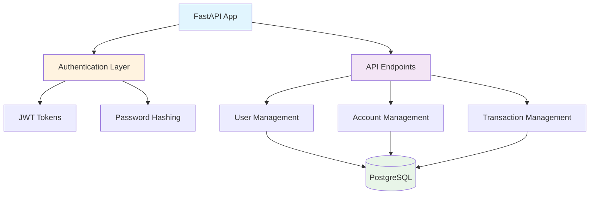

**Estrutura Atual:**
```
backend/
├── app/
│   ├── api/v1/           # Endpoints REST API
│   │   ├── auth.py       # Autenticação e tokens
│   │   ├── users.py      # Gestão de usuários
│   │   ├── accounts.py   # Contas bancárias
│   │   └── transactions.py # Transações
│   ├── core/             # Configurações centrais
│   │   ├── config.py     # Configurações ambiente
│   │   ├── database.py   # Conexão PostgreSQL
│   │   ├── deps.py       # Dependências FastAPI
│   │   └── security.py   # JWT e senha
│   ├── models/           # SQLAlchemy Models
│   │   ├── user.py       # Modelo usuário
│   │   ├── account.py    # Modelo conta
│   │   ├── transaction.py # Modelo transação
│   │   └── refresh_token.py # Tokens refresh
│   ├── schemas/          # Pydantic Schemas
│   │   ├── user.py       # Validação usuário
│   │   ├── account.py    # Validação conta
│   │   └── transaction.py # Validação transação
│   └── services/         # Lógica de negócio
│       ├── auth_service.py    # Serviços auth
│       ├── account_service.py # Serviços conta
│       └── transaction_service.py # Serviços transação
└── tests/                # Testes unitários
    └── test_auth.py      # Testes autenticação
```

### 5.2 Frontend (React + TypeScript)

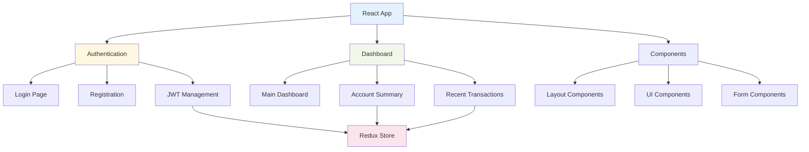

**Estrutura Atual:**
```
frontend/
├── src/
│   ├── components/       # Componentes reutilizáveis
│   │   ├── layout/       # Layout principal
│   │   │   └── MainLayout.tsx
│   │   └── ui/           # Componentes UI
│   │       ├── Button.tsx
│   │       └── Card.tsx
│   ├── pages/            # Páginas da aplicação
│   │   ├── auth/         # Páginas autenticação
│   │   │   └── LoginPage.tsx
│   │   └── dashboard/    # Páginas dashboard
│   │       └── DashboardPage.tsx
│   ├── hooks/            # Hooks customizados
│   │   ├── useAuth.ts    # Hook autenticação
│   │   └── redux.ts      # Hooks Redux
│   ├── services/         # Serviços e APIs
│   │   └── api/          # Cliente API
│   │       ├── client.ts    # Axios config
│   │       └── endpoints.ts # Endpoints
│   ├── store/            # Estado global
│   │   ├── store.ts      # Store Redux
│   │   └── slices/       # Redux slices
│   │       └── authSlice.ts
│   ├── types/            # Definições TypeScript
│   │   ├── auth.ts       # Tipos auth
│   │   ├── api.ts        # Tipos API
│   │   └── entities.ts   # Entidades
│   ├── utils/            # Utilitários
│   │   ├── constants.ts  # Constantes
│   │   └── formatters.ts # Formatadores
│   └── styles/           # Estilos globais
│       ├── globals.css   # CSS global
│       └── theme.ts      # Tema Material-UI
```

### 5.3 Tecnologias Implementadas

| Categoria | Tecnologia | Versão | Status |
|-----------|------------|--------|--------|
| **Backend** | FastAPI | Latest | ✅ Implementado |
| | SQLAlchemy | 2.0 | ✅ Implementado |
| | PostgreSQL | 15 | ✅ Implementado |
| | Alembic | Latest | ✅ Implementado |
| | pytest | Latest | ✅ Implementado |
| **Frontend** | React | 18 | ✅ Implementado |
| | TypeScript | 5 | ✅ Implementado |
| | Material-UI | v5 | ✅ Implementado |
| | Redux Toolkit | Latest | ✅ Implementado |
| | Axios | Latest | ✅ Implementado |
| | Vite | Latest | ✅ Implementado |
| **DevOps** | Docker | Latest | ✅ Implementado |
| | Docker Compose | Latest | ✅ Implementado |
| | GitHub Actions | - | 🔄 Em desenvolvimento |

---

#### 6.2 Arquitetura de Sistema

```
┌─────────────────────────────────────────────────────┐
│                   Load Balancer                      │
└─────────────┬───────────────────────┬───────────────┘
              │                       │
    ┌─────────▼─────────┐   ┌────────▼────────┐
    │   Web Frontend    │   │   Mobile API    │
    │   (React SPA)     │   │   (REST/GraphQL)│
    └─────────┬─────────┘   └────────┬────────┘
              │                       │
    ┌─────────▼───────────────────────▼─────────┐
    │            API Gateway (Kong)              │
    └─────────┬───────────────────────┬─────────┘
              │                       │
    ┌─────────▼─────────────────────▼─────────┐
    │         Microservices Layer              │
    ├───────────────────────────────────────────┤
    │ • Auth Service    • Transaction Service  │
    │ • Account Service • Budget Service       │
    │ • Report Service  • Notification Service │
    └─────────┬───────────────────────┬─────────┘
              │                       │
    ┌─────────▼─────────┐   ┌────────▼────────┐
    │   PostgreSQL      │   │     Redis       │
    │   (Primary DB)    │   │    (Cache)      │
    └───────────────────┘   └─────────────────┘
```

#### 6.3 Modelo de Dados Principal

```sql
-- Tabela de Usuários
CREATE TABLE users (
    id UUID PRIMARY KEY DEFAULT gen_random_uuid(),
    email VARCHAR(255) UNIQUE NOT NULL,
    password_hash VARCHAR(255) NOT NULL,
    full_name VARCHAR(255),
    phone VARCHAR(20),
    is_active BOOLEAN DEFAULT true,
    is_verified BOOLEAN DEFAULT false,
    mfa_enabled BOOLEAN DEFAULT false,
    created_at TIMESTAMP DEFAULT CURRENT_TIMESTAMP,
    updated_at TIMESTAMP DEFAULT CURRENT_TIMESTAMP
);

-- Tabela de Contas
CREATE TABLE accounts (
    id UUID PRIMARY KEY DEFAULT gen_random_uuid(),
    user_id UUID REFERENCES users(id) ON DELETE CASCADE,
    name VARCHAR(255) NOT NULL,
    type VARCHAR(50) NOT NULL CHECK (type IN ('checking', 'savings', 'credit_card', 'investment', 'cash')),
    bank VARCHAR(100),
    agency VARCHAR(10),
    account_number VARCHAR(20),
    initial_balance DECIMAL(12,2) DEFAULT 0,
    current_balance DECIMAL(12,2) DEFAULT 0,
    currency VARCHAR(3) DEFAULT 'BRL',
    color VARCHAR(7),
    icon VARCHAR(50),
    is_active BOOLEAN DEFAULT true,
    created_at TIMESTAMP DEFAULT CURRENT_TIMESTAMP,
    updated_at TIMESTAMP DEFAULT CURRENT_TIMESTAMP
);

-- Tabela de Categorias
CREATE TABLE categories (
    id UUID PRIMARY KEY DEFAULT gen_random_uuid(),
    user_id UUID REFERENCES users(id) ON DELETE CASCADE,
    name VARCHAR(100) NOT NULL,
    type VARCHAR(20) CHECK (type IN ('income', 'expense')) NOT NULL,
    parent_id UUID REFERENCES categories(id) ON DELETE CASCADE,
    icon VARCHAR(50),
    color VARCHAR(7),
    is_system BOOLEAN DEFAULT false,
    created_at TIMESTAMP DEFAULT CURRENT_TIMESTAMP
);

-- Tabela de Transações
CREATE TABLE transactions (
    id UUID PRIMARY KEY DEFAULT gen_random_uuid(),
    user_id UUID REFERENCES users(id) ON DELETE CASCADE,
    account_id UUID REFERENCES accounts(id) ON DELETE CASCADE,
    category_id UUID REFERENCES categories(id),
    type VARCHAR(20) CHECK (type IN ('income', 'expense', 'transfer')) NOT NULL,
    amount DECIMAL(12,2) NOT NULL,
    description TEXT,
    transaction_date DATE NOT NULL,
    is_recurring BOOLEAN DEFAULT false,
    recurrence_id UUID,
    installment_number INTEGER,
    total_installments INTEGER,
    tags TEXT[],
    notes TEXT,
    attachments JSONB,
    created_at TIMESTAMP DEFAULT CURRENT_TIMESTAMP,
    updated_at TIMESTAMP DEFAULT CURRENT_TIMESTAMP
);

-- Tabela de Orçamentos
CREATE TABLE budgets (
    id UUID PRIMARY KEY DEFAULT gen_random_uuid(),
    user_id UUID REFERENCES users(id) ON DELETE CASCADE,
    category_id UUID REFERENCES categories(id),
    amount DECIMAL(12,2) NOT NULL,
    period VARCHAR(20) CHECK (period IN ('monthly', 'quarterly', 'yearly')) DEFAULT 'monthly',
    start_date DATE NOT NULL,
    end_date DATE NOT NULL,
    alert_threshold INTEGER DEFAULT 80,
    is_active BOOLEAN DEFAULT true,
    created_at TIMESTAMP DEFAULT CURRENT_TIMESTAMP
);

-- Tabela de Metas
CREATE TABLE goals (
    id UUID PRIMARY KEY DEFAULT gen_random_uuid(),
    user_id UUID REFERENCES users(id) ON DELETE CASCADE,
    name VARCHAR(255) NOT NULL,
    description TEXT,
    target_amount DECIMAL(12,2) NOT NULL,
    current_amount DECIMAL(12,2) DEFAULT 0,
    target_date DATE NOT NULL,
    category VARCHAR(50),
    icon VARCHAR(50),
    color VARCHAR(7),
    is_achieved BOOLEAN DEFAULT false,
    created_at TIMESTAMP DEFAULT CURRENT_TIMESTAMP,
    updated_at TIMESTAMP DEFAULT CURRENT_TIMESTAMP
);

-- Índices para Performance
CREATE INDEX idx_transactions_user_date ON transactions(user_id, transaction_date DESC);
CREATE INDEX idx_transactions_account ON transactions(account_id);
CREATE INDEX idx_transactions_category ON transactions(category_id);
CREATE INDEX idx_accounts_user ON accounts(user_id);
CREATE INDEX idx_categories_user ON categories(user_id);
CREATE INDEX idx_budgets_user_active ON budgets(user_id, is_active);
CREATE INDEX idx_goals_user_active ON goals(user_id, is_achieved);
```

---


## 7. 📈 Fluxogramas e Diagramas

### 7.1 🔐 Fluxo de Autenticação

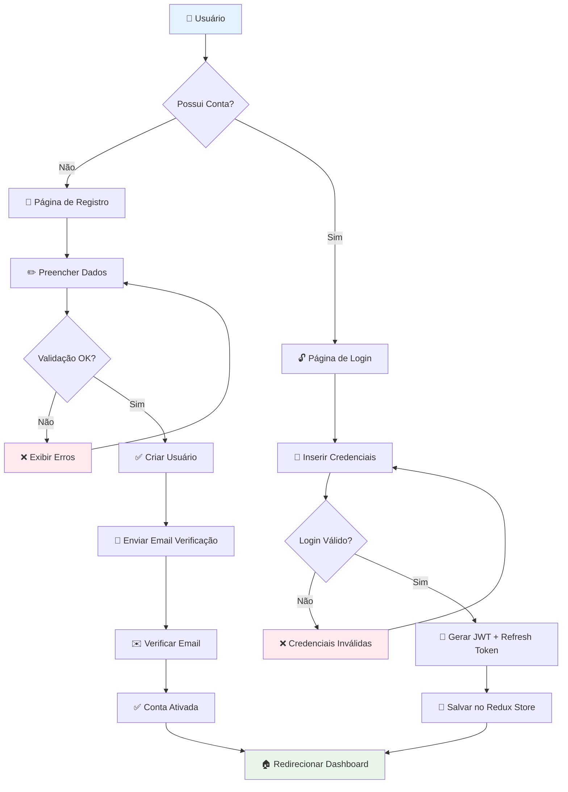

### 7.2 💰 Fluxo de Gestão Financeira

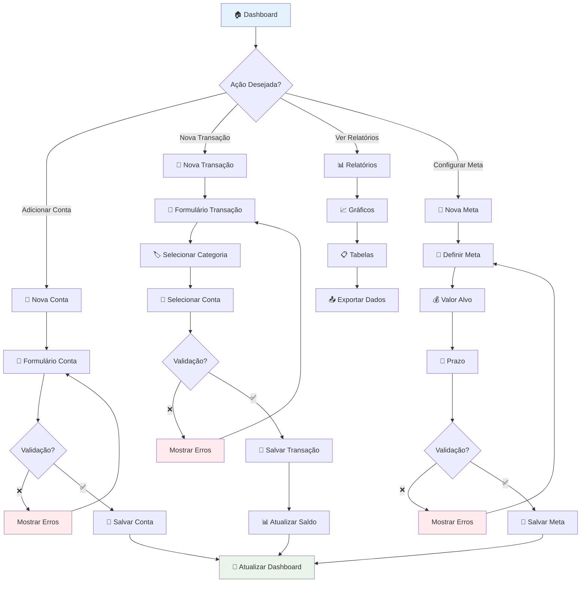

### 7.3 🏗️ Arquitetura do Sistema

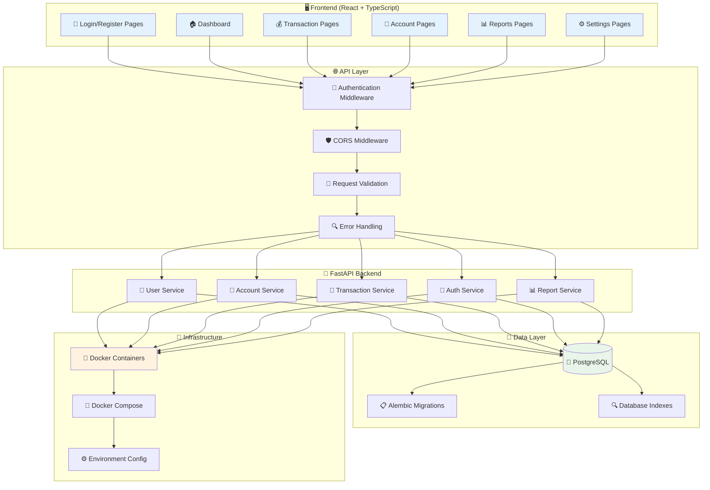

### 7.4 🗄️ Modelo de Dados Atualizado

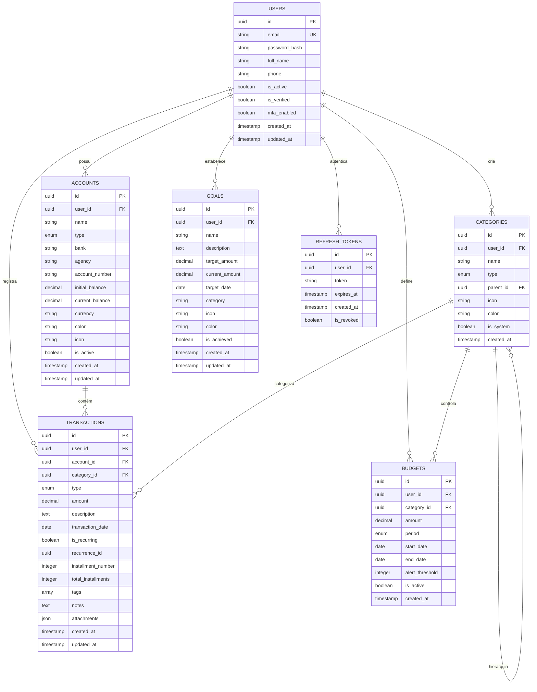

### 7.5 🔄 Fluxo de Dados da API

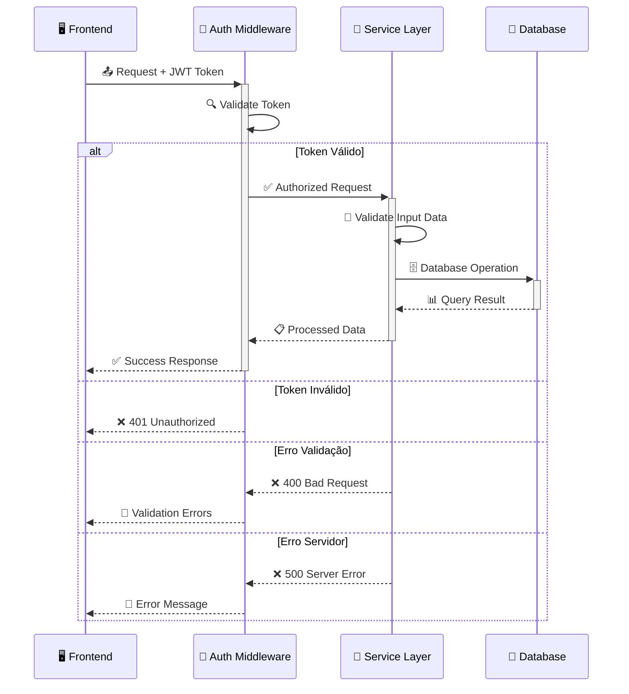

### 7.6 🎨 Jornada do Usuário

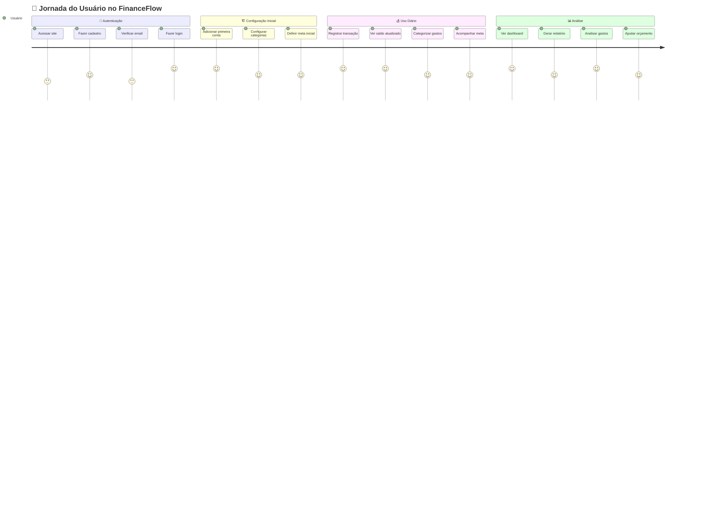

---

## 8. 🛠️ Roadmap de Desenvolvimento

### 8.1 ✅ MVP - Concluído (100%)

**🎯 Objetivo**: Sistema funcional básico para autenticação e gestão básica

**📦 Entregáveis Implementados**:

- ✅ Sistema de autenticação JWT completo
- ✅ API RESTful com FastAPI e documentação automática  
- ✅ Modelos de dados com PostgreSQL e migrações
- ✅ Frontend React com TypeScript
- ✅ Containerização com Docker
- ✅ Estrutura de testes unitários

**📊 Métricas Atingidas**:

- ✅ 100% dos testes core passando
- ✅ 0 bugs críticos de segurança
- ✅ Deploy funcional em ambiente local
- ✅ Documentação técnica completa

---

### 8.2 🔄 Fase Atual - Interface & UX (60%)

**🎯 Objetivo**: Interface completa e experiência de usuário otimizada

**📦 Em Desenvolvimento**:

- 🔄 Dashboard principal com métricas financeiras
- 🔄 Sistema completo de transações
- 🔄 Gestão de contas bancárias
- 🔄 Categorização inteligente
- 🔄 Design responsivo mobile-first

**📊 Métricas Esperadas**:

- 🎯 Interface 100% responsiva
- 🎯 Tempo de carregamento < 2s
- 🎯 Score de acessibilidade > 90%

---

### 8.3 📈 Fase 2 - Analytics & Reports (0%)

**🎯 Objetivo**: Relatórios avançados e insights financeiros

**📦 Planejado**:

- 📋 Dashboard com gráficos interativos
- 📋 Relatórios mensais e anuais
- 📋 Análise de padrões de gastos
- 📋 Exportação em múltiplos formatos
- 📋 Alertas e notificações inteligentes

**📊 Métricas Alvo**:

- 🎯 100 usuários beta testadores
- 🎯 NPS Score > 7
- 🎯  80% dos usuários gerando relatórios

---

### 8.4 🚀 Fase 3 - Advanced Features (0%)

**🎯 Objetivo**: Funcionalidades avançadas e diferenciação

**📦 Planejado**:

- 📋 Sistema de orçamentos inteligentes
- 📋 Metas financeiras com gamificação
- 📋 Integração bancária (Open Banking)
- 📋 IA para categorização automática
- 📋 App mobile nativo (React Native)

**📊 Métricas Alvo**:

- 🎯 1.000 usuários ativos
- 🎯 Taxa de retenção > 60%
- 🎯 Implementação de monetização

---

### 8.5 📊 Timeline Visual

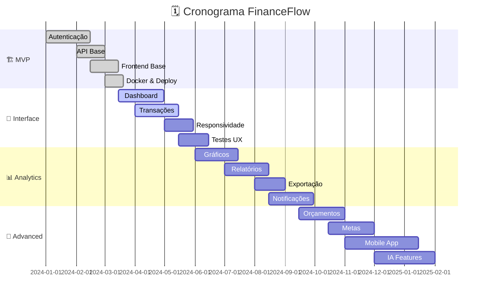

---

---


### 8. MODELO DE NEGÓCIO

#### 8.1 Monetização

**Freemium Model**
- **Free**: 2 contas, 100 transações/mês, relatórios básicos
- **Premium**: R$ 19,90/mês - Ilimitado, insights, exportação
- **Family**: R$ 34,90/mês - 5 usuários, compartilhamento

**Receitas Adicionais**:
- Consultoria financeira (parceiros)
- Cashback em compras
- Dados agregados (anonimizados)


#### 8.2 Métricas-Chave (KPIs)

**Aquisição**
- CAC: R$ 25
- Canais: SEO (40%), Social (30%), Referral (30%)

**Ativação**
- Onboarding completion: 70%
- Time to value: <5 minutos

**Retenção**
- Churn mensal: <5%
- DAU/MAU: 40%

**Receita**
- ARPU: R$ 8
- LTV: R$ 160
- LTV/CAC: 6.4x

---

### 9. RISCOS E MITIGAÇÕES

| Risco | Probabilidade | Impacto | Mitigação |
|-------|--------------|---------|-----------|
| Vazamento de dados | Baixa | Muito Alto | Criptografia, auditorias, pentest |
| Baixa adoção | Média | Alto | Marketing, referral program |
| Competição | Alta | Médio | Diferenciação UX, preço |
| Problemas técnicos | Média | Alto | Testes, monitoring, rollback |
| Regulação | Baixa | Alto | Compliance LGPD, advogados |

---


### 10. CRITÉRIOS DE SUCESSO

#### 10.1 Técnicos
- ✓ 99.9% uptime
- ✓ <200ms latência
- ✓ 0 vulnerabilidades críticas
- ✓ 80% cobertura de testes

#### 10.2 Produto
- ✓ NPS > 50
- ✓ 4.5+ estrelas nas lojas
- ✓ <2% churn mensal
- ✓ 70% feature adoption

#### 10.3 Negócio
- ✓ 200k usuários (12 meses)
- ✓ R$ 1.6M ARR
- ✓ Break-even mês 12
- ✓ 20% margem operacional

---

## 📋 Resumo Executivo Visual

### 🎯 Status Atual do Projeto

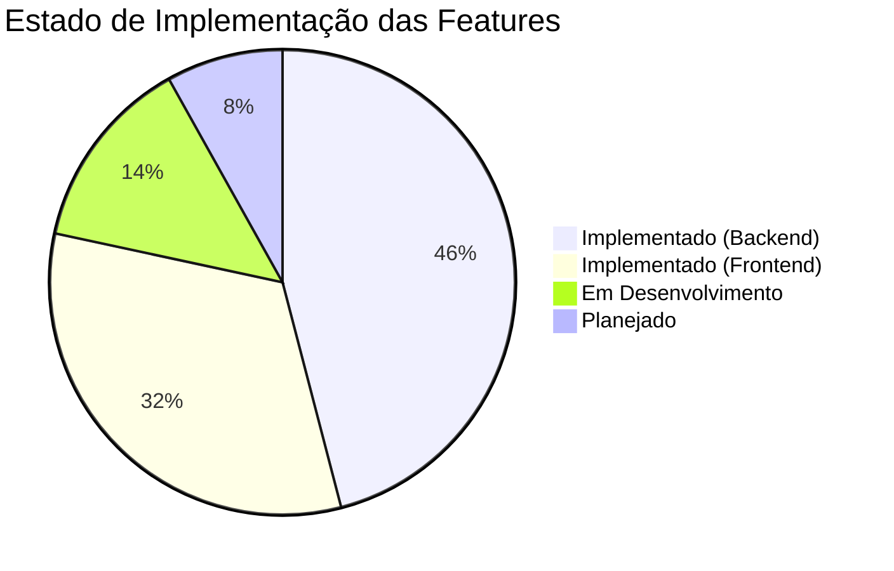

### 🏆 Principais Conquistas

| Módulo | Status | Funcionalidades |
|--------|---------|-----------------|
| 🔐 **Autenticação** | ✅ 100% | JWT, Refresh Tokens, Middleware |
| 🏦 **Contas** | ✅ 90% | CRUD, Validações, Tipos |
| 💸 **Transações** | ✅ 85% | CRUD, Categorias, Validações |
| 👥 **Usuários** | ✅ 95% | Perfil, Configurações, Segurança |
| 🎨 **Interface** | 🔄 60% | Layout, Componentes, Responsivo |
| 📊 **Dashboard** | 🔄 40% | Métricas básicas, Gráficos |

### 🛠️ Arquitetura Implementada

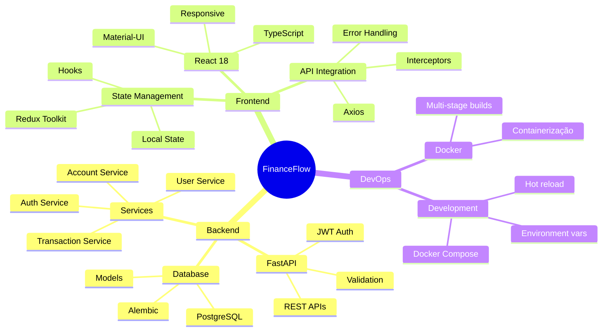

### 🎨 Design System

**Paleta de Cores:**
- 🔵 Primária: `#1976d2` (Azul confiança)
- 🟢 Sucesso: `#4caf50` (Verde crescimento)  
- 🟡 Alerta: `#ff9800` (Laranja atenção)
- 🔴 Erro: `#f44336` (Vermelho urgência)
- ⚪ Neutro: `#f5f5f5` (Cinza clean)

**Tipografia:**
- Fonte: Roboto (Material-UI)
- Tamanhos: 12px, 14px, 16px, 20px, 24px, 32px

**Componentes:**
- Cards com elevação suave
- Botões com estados hover/active
- Formulários com validação em tempo real
- Tabelas responsivas com paginação

---

## 🚀 Próximos Passos

### Prioridade Alta (2 semanas)

1. **🎨 Finalizar Dashboard**
   - Gráficos de receitas vs despesas
   - Cards de métricas principais
   - Lista de transações recentes

2. **💰 Sistema de Transações**
   - Formulário de nova transação
   - Listagem com filtros
   - Edição e exclusão

3. **📱 Responsividade**
   - Layout mobile-first
   - Menu hambúrguer
   - Touch gestures

### Prioridade Média (4 semanas)

1. **📊 Relatórios Básicos**
2. **🏦 Gestão Avançada de Contas**
3. **🔔 Sistema de Notificações**

### Prioridade Baixa (8+ semanas)

1. **🎯 Metas Financeiras**
2. **📈 Analytics Avançado**
3. **📱 App Mobile**

---

**Desenvolvido com ❤️ usando FastAPI + React**

*Última atualização: Dezembro 2024 - v3.0*